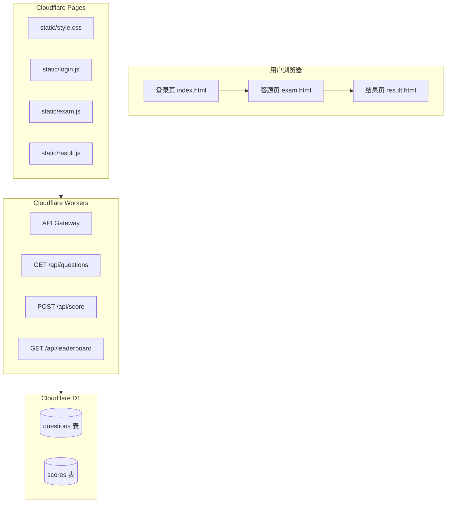
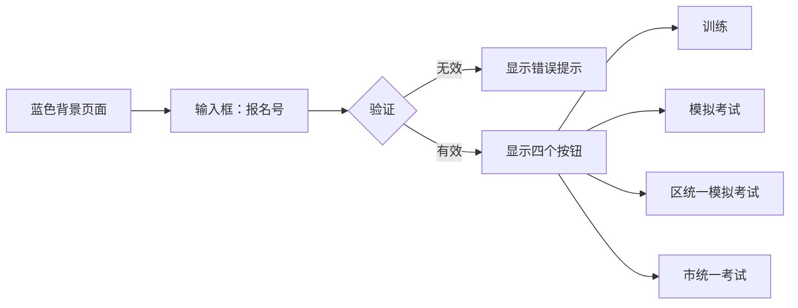
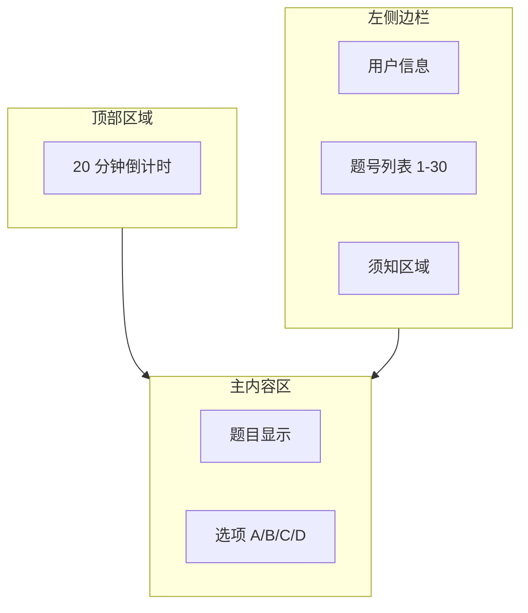

# 模拟考试抽题系统 - 架构设计文档

## 1. 系统概述

### 1.1 项目目标

创建一个基于 Cloudflare 免费版的模拟考试抽题网页应用，支持训练模式和模拟考试模式。

### 1.2 本地开发环境

| 工具                   | 用途                 | 命令                                   |
| ---------------------- | -------------------- | -------------------------------------- |
| **live-server**        | 前端本地测试         | `npx live-server public`               |
| **Python http.server** | 前端本地测试（备选） | `python -m http.server 8080 -d public` |
| **Wrangler dev**       | 后端本地测试         | `cd workers && npx wrangler dev`       |

### 1.3 技术栈

| 组件     | 技术                   | 说明              |
| -------- | ---------------------- | ----------------- |
| 前端托管 | Cloudflare Pages       | 静态网站托管      |
| 前端框架 | 原生 JavaScript (ES6+) | 无依赖，加载快    |
| 后端 API | Cloudflare Workers     | 无服务器函数      |
| 数据库   | Cloudflare D1          | SQLite 边缘数据库 |
| 样式     | CSS3                   | 自定义样式        |

---

## 2. 系统架构



---

## 3. 数据库设计

### 3.1 题库表 (questions)

```sql
CREATE TABLE questions (
    id INTEGER PRIMARY KEY,
    question_text TEXT NOT NULL,
    option_a TEXT NOT NULL,
    option_b TEXT NOT NULL,
    option_c TEXT NOT NULL,
    option_d TEXT NOT NULL,
    correct_answer TEXT NOT NULL CHECK(correct_answer IN ('A', 'B', 'C', 'D')),
    image_url TEXT,
    created_at DATETIME DEFAULT CURRENT_TIMESTAMP
);
```

### 3.2 成绩表 (scores)

```sql
CREATE TABLE scores (
    id INTEGER PRIMARY KEY AUTOINCREMENT,
    user_id TEXT NOT NULL,
    user_name TEXT,
    registration_number TEXT NOT NULL,
    mode TEXT NOT NULL CHECK(mode IN ('practice', 'mock')),
    score INTEGER NOT NULL,
    total_questions INTEGER NOT NULL DEFAULT 30,
    created_at DATETIME DEFAULT CURRENT_TIMESTAMP
);

CREATE INDEX idx_scores_mode_score ON scores(mode, score DESC);
```

---

## 4. API 设计

### 4.1 获取随机题目

```
GET /api/questions?mode={mode}&count={count}
```

**请求参数**：
| 参数 | 类型 | 必填 | 说明 |
|------|------|------|------|
| mode | string | 否 | 'practice' 或 'mock'（用于区分统计） |
| count | number | 否 | 题目数量，默认 30 |

**响应示例**：

```json
{
  "success": true,
  "data": [
    {
      "id": 1,
      "question_text": "题目内容...",
      "option_a": "选项 A",
      "option_b": "选项 B",
      "option_c": "选项 C",
      "option_d": "选项 D",
      "correct_answer": "A",
      "image_url": null
    }
  ],
  "count": 30
}
```

### 4.2 上传成绩

```
POST /api/score
Content-Type: application/json
```

**请求体**：

```json
{
  "user_id": "e3b0c44298fc...",
  "user_name": "张三",
  "registration_number": "123456",
  "mode": "mock",
  "score": 28,
  "total_questions": 30,
  "answers": {"0": "A", "1": "C", ...}
}
```

**响应示例**：

```json
{
  "success": true,
  "data": {
    "score_id": 123,
    "rank": 5
  }
}
```

### 4.3 获取排行榜

```
GET /api/leaderboard?mode=mock&limit=10
```

**响应示例**：

```json
{
  "success": true,
  "data": [
    {
      "rank": 1,
      "user_name": "李四",
      "registration_number": "654321",
      "score": 30,
      "created_at": "2024-01-01T10:00:00Z"
    }
  ]
}
```

---

## 5. 前端页面设计

### 5.1 登录页 (index.html)



**页面元素**：

- 蓝色背景 (#1e3a8a)
- 白色卡片容器
- 报名号输入框（纯数字验证）
- 四个考试类型按钮（先实现前两个）

### 5.2 答题页 (exam.html)



**布局结构**：

```
┌─────────────────────────────────────────────┐
│           倒计时 19:58                      │
├──────────┬──────────────────────────────────┤
│ 头像     │                                  │
│ 姓名     │         题目内容                  │
│ 报名号   │         [图片]                   │
│          │                                  │
│ ┌─────┐  │  ○ A. 选项 A                     │
│ │ 1 2 │  │  ○ B. 选项 B                     │
│ │ 3 4 │  │  ○ C. 选项 C                     │
│ │ ... │  │  ○ D. 选项 D                     │
│ │29 30│  │                                  │
│ └─────┘  │         [交卷按钮]                │
│          │                                  │
│ 须知     │                                  │
└──────────┴──────────────────────────────────┘
```

**交互逻辑**：

1. 点击题号 → 跳转到对应题目
2. 选择选项 → 自动保存答案
3. 倒计时 → 每秒更新，<5 分钟时启用交卷按钮
4. 交卷 → 计算分数，跳转到结果页

### 5.3 结果页 (result.html)

**训练模式**：

- 显示总分
- 显示错题列表（题目、用户答案、正确答案）
- 按钮：重新练习、返回首页

**模拟考试**：

- 显示总分
- 按钮：上传排行榜（可选）、返回首页

---

## 6. 核心逻辑实现

### 6.1 用户标识生成

```javascript
/**
 * 基于报名号生成 SHA-256 哈希作为用户唯一标识
 * @param {string} registrationNumber - 纯数字报名号
 * @returns {Promise<string>} 64 位十六进制哈希值
 */
async function generateUserId(registrationNumber) {
  const encoder = new TextEncoder();
  const data = encoder.encode(registrationNumber);
  const hashBuffer = await crypto.subtle.digest("SHA-256", data);
  const hashArray = Array.from(new Uint8Array(hashBuffer));
  return hashArray.map((b) => b.toString(16).padStart(2, "0")).join("");
}
```

### 6.2 倒计时逻辑

```javascript
class ExamTimer {
  constructor(durationSeconds, onTick, onExpire) {
    this.totalSeconds = durationSeconds;
    this.remainingSeconds = durationSeconds;
    this.onTick = onTick;
    this.onExpire = onExpire;
    this.intervalId = null;
  }

  start() {
    this.intervalId = setInterval(() => {
      this.remainingSeconds--;
      this.onTick(this.remainingSeconds);

      if (this.remainingSeconds <= 0) {
        this.expire();
      }
    }, 1000);
  }

  canSubmit() {
    // 模拟考试：剩余时间 < 5 分钟 (300 秒) 才可交卷
    return this.remainingSeconds <= 300;
  }

  getFormattedTime() {
    const minutes = Math.floor(this.remainingSeconds / 60);
    const seconds = this.remainingSeconds % 60;
    return `${minutes.toString().padStart(2, "0")}:${seconds.toString().padStart(2, "0")}`;
  }

  expire() {
    this.stop();
    this.onExpire();
  }

  stop() {
    if (this.intervalId) {
      clearInterval(this.intervalId);
      this.intervalId = null;
    }
  }
}
```

### 6.3 分数计算

```javascript
/**
 * 计算考试分数
 * @param {Array} questions - 题目数组
 * @param {Object} userAnswers - 用户答案 {0: 'A', 1: 'C', ...}
 * @returns {Object} {score, total, wrongQuestions}
 */
function calculateScore(questions, userAnswers) {
  let correctCount = 0;
  const wrongQuestions = [];

  questions.forEach((q, index) => {
    const userAnswer = userAnswers[index];
    if (userAnswer === q.correct_answer) {
      correctCount++;
    } else {
      wrongQuestions.push({
        ...q,
        userAnswer,
        questionIndex: index + 1,
      });
    }
  });

  return {
    score: correctCount,
    total: questions.length,
    wrongQuestions,
  };
}
```

---

## 7. 文件结构

```
PhyChemBio-Sim/
├── public/
│   ├── index.html          # 登录页
│   ├── exam.html           # 答题页
│   ├── result.html         # 结果页
│   └── static/
│       ├── style.css       # 全局样式
│       ├── login.js        # 登录页逻辑
│       ├── exam.js         # 答题页逻辑
│       └── result.js       # 结果页逻辑
├── workers/
│   ├── src/
│   │   ├── index.ts        # Workers 入口
│   │   ├── api.ts          # API 路由定义
│   │   └── db.ts           # D1 数据库操作
│   ├── wrangler.toml       # Workers 配置
│   └── package.json
├── scripts/
│   └── parse_excel.py      # Excel 解析脚本
├── data/
│   ├── questions.json      # 解析后的题目数据
│   └── init-db.sql         # D1 初始化脚本
├── plans/
│   └── architecture.md     # 本文件
└── README.md
```

---

## 8. Cloudflare 配置

### 8.1 Pages 配置

- 构建命令：无（纯静态）
- 输出目录：`public`
- 环境变量：
  - `VITE_API_URL`：Workers API 地址

### 8.2 Workers 配置 (wrangler.toml)

```toml
name = "phychembio-sim-api"
main = "src/index.ts"
compatibility_date = "2024-01-01"

[[d1_databases]]
binding = "DB"
database_name = "phychembio-sim"
database_id = "YOUR_DATABASE_ID"

[vars]
CORS_ORIGIN = "https://your-pages-url.pages.dev"
```

---

## 9. 开发环境要求

| 工具         | 版本  | 用途                    |
| ------------ | ----- | ----------------------- |
| Node.js      | >=18  | 运行脚本和 Workers 开发 |
| Python       | >=3.8 | Excel 解析脚本          |
| Wrangler CLI | 最新  | Cloudflare 部署工具     |

---

## 10. Cloudflare 免费版限额

| 服务    | 免费额度        | 预估用量 |
| ------- | --------------- | -------- |
| Pages   | 无限            | ✅       |
| Workers | 10 万次请求/天  | ✅       |
| D1      | 100 万行读取/天 | ✅       |
| D1      | 5 万次写入/天   | ✅       |

---

## 11. 安全考虑

1. **CORS 限制**：Workers API 只允许来自指定 Pages 域名的请求
2. **输入验证**：报名号必须为纯数字
3. **防作弊**：
   - 倒计时在前端显示，但交卷时间在服务端验证
   - 题目顺序随机打乱
4. **数据隐私**：用户标识使用哈希，不存储明文报名号

---

## 12. 后续扩展

- [ ] 区统一模拟考试
- [ ] 市统一考试
- [ ] 用户自定义头像上传
- [ ] 错题本功能
- [ ] 答题记录历史
- [ ] 管理员后台（题库管理）
